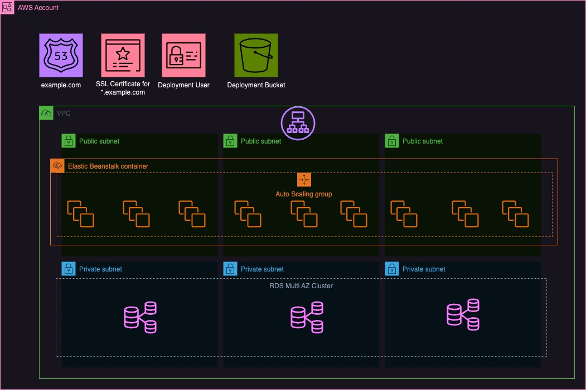

AWS Elastic Beanstalk Application with connected RDS
====================================================

Creates an Elastic Beanstalk application and environment in a dedicated VPC and attached RDS Cluster using Terraform

# Dependencies
* [Terraform](https://www.terraform.io/)
* [AWS Account](https://aws.amazon.com/)
* [Domain Name](https://godaddy.com/)
* [AWS CLI](https://aws.amazon.com/cli/)

# Assumptions
* You already signed up for an [AWS Account](https://aws.amazon.com/)
* You already set up [AWS CLI](https://aws.amazon.com/cli/)
* You already created an SSH keypair on your local machine.

# AWS Prerequisites
At this time there is no automatic provisioning for a given domain name in your AWS account. So the prerequisite is that you already set up your domain name in Route 53 and created a wildcard SSL certificate using ACM. You'll need the ARN of the SSL certificate. 

# Provisioning resources using Terraform
Once you set up and fulfill all prerequisites your good to go for provisioning resources on AWS using Terraform.
## Get prepared
1. Clone this repo using: `git clone git@github.com:katunch/terraform-aws-elasticbeanstalk-application-stack.git`
2. Copy `terraform.tfvars.sample` to `terraform.tfvars` and adjust the variables to your needs.

There are more variables which can be set. Please refer to `./vars.tf` for further information.

## Get things ready
Run the following commands to provision the resources in your AWS account.
1. `terraform init` to install all modules and deppendencies
2. `terraform plan` to get an overview what happens in your AWS account. 
3. `terraform apply` will create the resources.

## Variables and Outputs
### Variables
| Variable                 | Mandatory | Description                                                                                                                       | Default Value                                                |
| ------------------------ | --------- | --------------------------------------------------------------------------------------------------------------------------------- | ------------------------------------------------------------ |
| `applicationName`        | yes       | The name of your application. For best results use [Kebab Case](https://developer.mozilla.org/en-US/docs/Glossary/Kebab_case).    |                                                              |
| `applicationEnvironment` | yes       | The tier of your application. For example: `production`, `integration` or `test`                                                  |                                                              |
| `dns_name`               | yes       | The fully qualified domain name where your application should be available.                                                       |                                                              |
| `ssl_cert_arn`           | yes       | The ARN of the wildcard certificate created in ACM.                                                                               |                                                              |
| `aws_region`             | no        | The AWS region in which the resources will be provisioned.                                                                        | `eu-central-1`                                               |
| `aws_profile`            | no        | If you have configured multiple profiles in your AWS CLI you can provide the profile name. Otherwise use `default`                | `default`                                                    |
| `ssh_public_key_path`    | no        | Specifiy an SSH public key to access your instances on AWS.                                                                       | `~/.ssh/id_rsa.pub`                                          |
| `jira_key`               | no        | You can specifiy a Jira key which will be added as Tag to each resource.                                                          | `NOPE`                                                       |
| `availability_zones`     | no        | A list of availability zones which will be used to provision resources. These have to correspond with your selected `aws_region`. | `["eu-central-1a", "eu-central-1b", "eu-central-1c"]`        |
| `vpc_cidr_block`         | no        | CIDR block of your VPC.                                                                                                           | `10.0.0.0/16`                                                |
| `public_subnet_cidrs`    | no        | List of CIDR blocks for  public subnets.                                                                                          | `["10.0.0.0/24", "10.0.1.0/24", "10.0.2.0/24"]`              |
| `private_subnet_cidrs`   | no        | List of CIDR blocks for private subnets.                                                                                          | `["10.0.3.0/24", "10.0.4.0/24", "10.0.5.0/24"]`              |
| `eb_solution_stack_name` | no        | The soulution stack which will be used in Elastic Beanstalk.                                                                      | `64bit Amazon Linux 2 v4.3.12 running Tomcat 8.5 Corretto 8` |
| `eb_instance_type`       | no        | The EC2 instance type which will be used in Elastic Beanstalk.                                                                    | `t4g.micro`                                                  |

## Outputs
| Property                        | Description                                                             |
| ------------------------------- | ----------------------------------------------------------------------- |
| `Jumphost_IP`                   | The public IP of your bastion host.                                     |
| `Jumphost_Hostname`             | The public hostname of your bastion host.                               |
| `RDS_HOSTNAME`                  | Endpoint of your RDS cluster. Only available within the VPC.            |
| `RDS_HOSTNAME_READONLY`         | Readonly endpoint of your RDS cluster. Only available within your VPC.  |
| `RDS_USERNAME`                  | Master username for your RDS cluster.                                   |
| `RDS_PASSWORD`                  | Master password for your RDS cluster.                                   |
| `RDS_DB_NAME`                   | Database name.                                                          |
| `s3_deployment_bucket_name`     | The bucket which was created for Elastic Beanstalk deployment packages. |
| `eb_cname`                      | Automaticly generated CNAME of the Elastic Beanstalk environment.       |
| `eb_environmentId`              | The ID of the Elastic Beanstalk environment.                            |
| `eb_environmentName`            | The name of the Elastic Beanstalk environment.                          |
| `AWS_KEY_ID`                    | Generated AWS_KEY_ID for deployment user.                               |
| `AWS_SECRET_ACCESS_KEY`         | Generated secret access key for deployment user.                        |
| `opensearch_endpoint`           | Endpoint of Opensearch Domain. Only available within the VPC.           |
| `opensearch_dashboard_endpoint` | Access to Opensearch Dashboard. Only available within VPC.              |
| `opensearch_master_user`        | Master user of Opensearch Domain                                        |
| `opensearch_master_password`    | Autogenerated master password of Opensearch Domain                      |
# Todos
## DNS in Route 53
At this time the CNAME of your Elastic Beanstalk environment will not be added in Route 53 hosted zone. You have to do this manually.